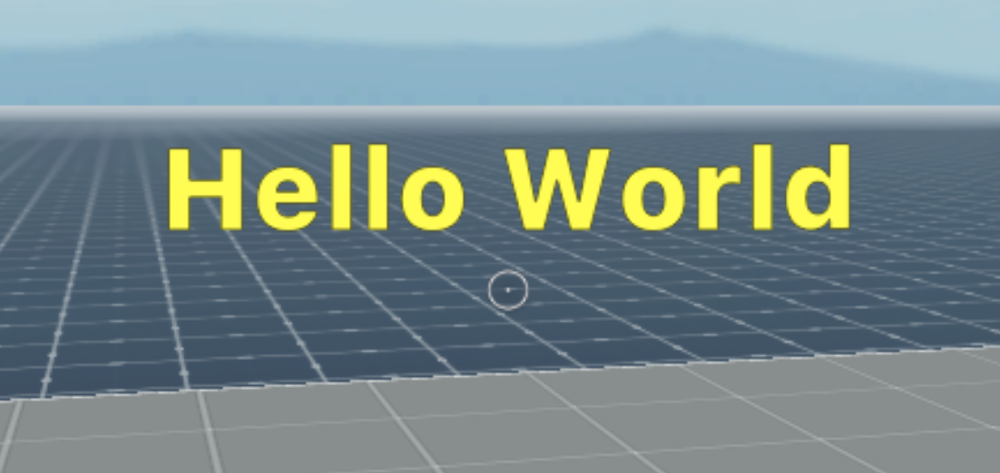
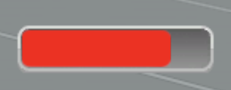
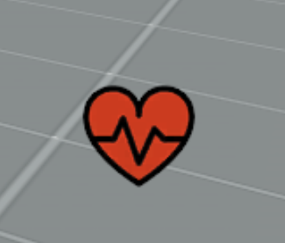
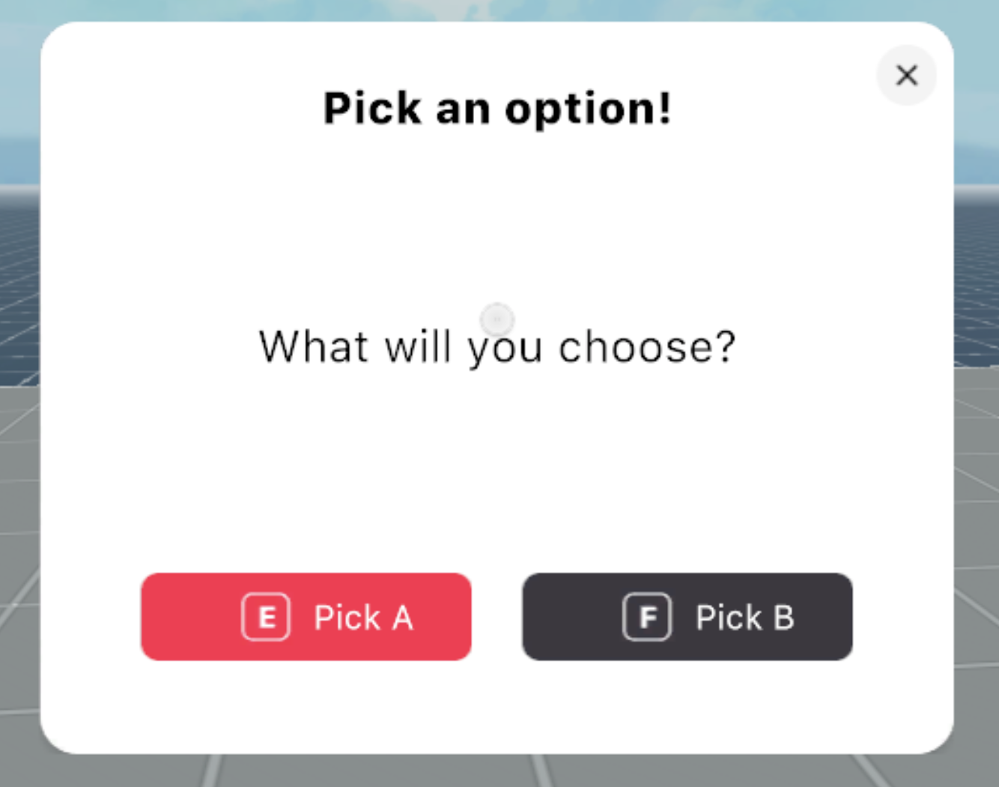
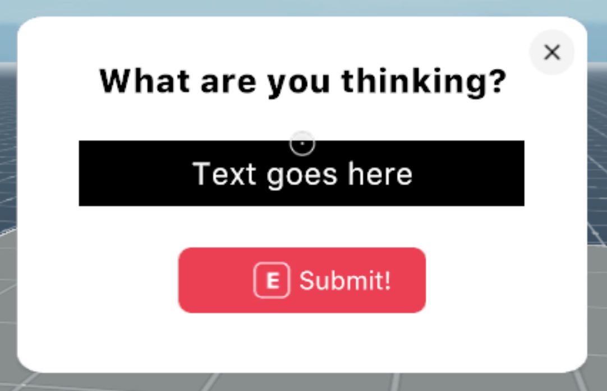
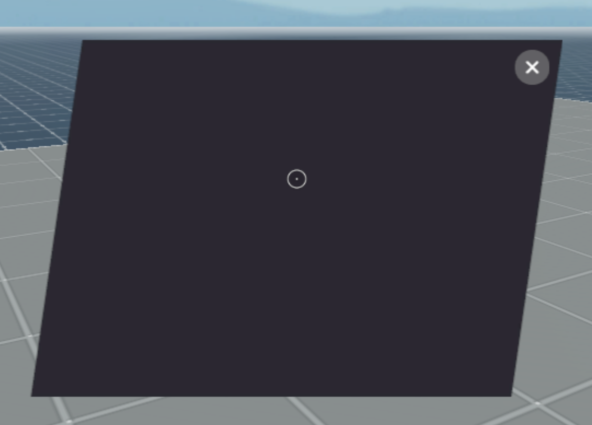

# UI-library

A collection of tools for common UI requirements for Decentraland scenes.

To use any of the helpers provided by the UI utils library:

1. Install the library as an npm package. Run this command in your scene's project folder:

```
npm i @dcl/ui-scene-utils -B
```

2. Run `dcl start` or `dcl build` so the dependencies are correctly installed.

3. Import the library into the scene's script. Add this line at the start of your `game.ts` file, or any other TypeScript files that require it:

```ts
import * as ui from '@dcl/ui-scene-utils'
```

4. In your TypeScript file, write `ui`. and let the suggestions of your IDE show the available helpers.

## Text Announcement

To display a text announcement on the center of the screen for a specified amount of time, use the `displayAnnouncement` function.

```ts
ui.displayAnnouncement('Hello world')
```



This function can take the following parameters:

- `value`: String to display
- `duration`: Time to keep the text visible (in seconds). Default: 3 seconds. If set to -1, the announcement will remain on screen till it's hidden.
- `silent`: By default the `displayAnnouncement` function plays a notification sound when the text appears. If this flag is true, the sound is avoided.
- `color`: Text color, as a _Color4_, default: yellow.
- `size`: Font size, default: 50
- `bordersOff`: The text has a thin black margin unless this field is set to _true_.

```ts
ui.displayAnnouncement('Ouch!', 5, true, Color4.Red(), 50, true)
```

To hide any open announcements, you can call `hideAnnouncements()`.

```ts
ui.hideAnnouncements()
```

## Counter

To display a number on a corner of the screen that can be easily updated, you can create a `Counter`.

```ts
let ammo = new ui.UICounter(30)
```


When instancing a new counter you can pass the following parameters:

- `value`: Starting value
- `xOffset`: Offset on X away from the bottom-left corner
- `yOffset`: Offset on Y away from the bottom-left corner
- `color`: Text color, white by default
- `size`: Text size, 25 by default
- `bordersOff`: The text has a thin black margin unless this field is set to _true_.

```ts
let ammo = new ui.UICounter(30, 0, 60, Color4.Yellow(), 30, true)
```

Once a `UICounter` object is instanced, you can call the following functions on it:

- `read`: Returns the current value of the counter
- `increase`: Increases the number by a given amount. If no parameters are passed, it raises the value by 1.
- `decrease`: Decreases the number by a given amount. If no parameters are passed, it lowers the value by 1.
- `set`: Sets the number to a given amount, no matter what the previous value was.

```ts
myEntiy.addComponent(new OnPointerDown(e => {
  if (ammo.read() <= 0) return
  ammo.decrease()
})
```

## Corner Labels

To display text on the bottom-left corner of the screen, you can create a `CornerLabel`.

```ts
let healthLabel = new ui.CornerLabel('Health:')
```

When instancing a new corner label you can pass the following parameters:

- `value`: Text to show.
- `xOffset`: Offset on X, relative to the bottom-right corner.
- `yOffset`: Offset on Y, relative to the bottom-right corner.
- `color`: Text color, white by default
- `size`: Text size, 25 by default
- `bordersOff`: The text has a thin black margin unless this field is set to _true_.

## Bar

To display a bar that can be updated to increase or shorten in length, similar to a typical health bar in games, you can create a `UIBar`.

```ts
let health = new ui.UIBar(0.8)
```



When instancing a new bar you can pass the following parameters:

- `value`: Starting value of the bar, from 0 to 1. With 1 the bar is full, with 0 it's empty.
- `xOffset`: Offset on X away from the bottom-left corner.
- `yOffset`: Offset on Y away from the bottom-left corner.
- `fillColor`: Color of the bar filling, red by default.
- `style`: Margin style of the bar, from a list of different predetermined options in different colors and shapes. It takes a value from the `BarStyles` enum.
- `scale`: Multiplier to alter the size of the bar proportionally. A scale of 1 = 128 x 32 pixels.

```ts
let health = new ui.UIBar(1, -30, 130, Color4.Red(), ui.BarStyles.ROUNDSILVER, 1)
```

Once a `UIBar` object is instanced, you can call the following functions on it:

- `read`: Returns the current value of the counter.
- `increase`: Increases the number by a given amount. If no parameters are passed, it raises the value by 0.1.
- `decrease`: Secreases the number by a given amount. If no parameters are passed, it lowers the value by 0.1.
- `set`: Sets the bar to a given value, no matter what the previous value was.

```ts
myEntiy.addComponent(new OnPointerDown(e => {
	health.decrease(0.1)
	if (health.read() <= 0) {
		// die
	}
})
```

## Corner Icons

To display an icon of on the bottom-left corner of the screen you can create one of the following:

- `SmallIcon`: by default 32x32 pixels in size.
- `MediumIcon`: by default 64x64 pixels in size.
- `LargeIcon`: by default 128x128 pixels in size.

```ts
let healthIcon = new ui.MediumIcon('images/heart64.png')
```



When instancing a new icon you can pass the following parameters:

- `image`: Path to the image file.
- `xOffset`: Offset on X, relative to the bottom-right corner.
- `yOffset`: Offset on Y, relative to the bottom-right corner.
- `width`: Image width on screen in pixels.
- `height`: Image height on screen in pixels.
- `section`: Use only a section of the image file, useful when arranging multiple icons into an image atlas. This field takes an `ImageSection` object, specifying `sourceWidth` and `sourceHeight`, and optionally also `sourceLeft` and `sourceTop`.

```ts
let ammoIcon = new ui.SmallIcon('images/ammo32.png', -70, 70)
let healthIcon = new ui.MediumIcon('images/heart64.png', -170, 120)
```

## Loading icon

To display a loading icon on the center of the screen for a specified amount of time, create a `LoadingIcon`.

```ts
loading = new ui.LoadingIcon(3)
```


When instancing a new loading icon, you can pass the following parameters:

- `duration`: seconds to display the image onscreen. If not set, or set to 0, it keeps the icon on till you hide it.
- `xOffset`: Offset on X, relative to the center of the screen.
- `yOffset`: Offset on Y, relative to the center of the screen.
- `scale`: Multiplier to alter the size of the icon proportionally. A scale of 1 = 48 x 64 pixels.

```ts
loading = new ui.LoadingIcon(3, 0, 40, 0.5)
```

Once a `LoadingIcon` object is instanced, you can call the `hide()` function to remove it.

## Full screen image

To display a large image on the center of the screen for a spefified amount of time, create a `CenterImage`. By default images must be 512 x 512 pixels, unless specified.

```ts
let largeImage = new ui.CenterImage('images/Burn.png')
```

When instancing a new large image, you can pass the following parameters:

- `image`: Path to image file.
- `duration`: Seconds to display the image onscreen, 3 seconds by default. -1 keeps it on till you hide it.
- `startHidden`: If true, the image starts invisible till you run its `show()` function. Large images may flash white for a second if created and shown at the same time. By deferring the creation you avoid this artifact.
- `xOffset`: Offset on X, relative to the center of the screen.
- `yOffset`: Offset on Y, relative to the center of the screen.

* `width`: Image width on screen in pixels, 512 by default.
* `height`: Image height on screen in pixels, 512 by default.
* `section`: Use only a section of the image file, useful when arranging multiple images into an image atlas. This field takes an `ImageSection` object, specifying `sourceWidth` and `sourceHeight`, and optionally also `sourceLeft` and `sourceTop`.

```ts
let gameOver = new ui.CenterImage('images/Burn.png', 3, true, 0, 0, 512, 512, {
  sourceHeight: 512,
  sourceWidth: 512,
  sourceLeft: 0,
  sourceTop: 0
})
gameOver.show()
```

Once a `CenterImage` object is instanced, you can call the following functions on it:

- `show`: Shows the image.
- `hide`: Hides the image.

## Predefined prompt windows

The UI Utils library includes various common prompt windows to display messages and ask players to take action.

### Ok Prompt

Displays a prompt window with a custom message and an OK button. The Ok button can either be clicked or triggered by pressing the E key.

When instancing a new Ok Prompt, you can pass the following parameters:

- `instructions`: Message string.
- `onAccept`: Function that gets executed if player clicks the button or presses E.
- `acceptLabel`: Label to go in the accept button, "Ok" by default.
- `useDarkTheme`: Switch the style of the window to the dark theme.

```ts
let prompt = new ui.OkPrompt(
  'This is an Ok Prompt',
  () => {
    log(`accepted`)
  },
  'Ok',
  true
)
```


> Note: If the player closes the window with the close icon, the related function isn't called.

### Option Prompt

Displays a prompt window with a custom message, a title, and two buttons that perform separate actions. The buttons can be clicked or triggered by the E and F keys.

When instancing a new Option Prompt, you can pass the following parameters:

- `title`: Header in bold letters at the top of the window
- `instructions`: Smaller print instructions.
- `onAccept`: Function that gets executed if player clicks accept.
- `onReject`: Function that gets executed if player clicks reject.
- `acceptLabel`: String to go in the accept button
- `rejectLabel`: String to go in the reject button
- `useDarkTheme`: Switch the style of the window to the dark theme.

```ts
let prompt = new ui.OptionPrompt(
  'Pick an option!',
  'What will you choose?',
  () => {
    log(`picked option A`)
  },
  () => {
    log(`picked option B`)
  },
  'Pick A',
  'Pick B'
)
```



> Note: If the player closes the window with the close icon, neither of the functions are called.

### Fill in Prompt

Displays a prompt window with a header, a text field to fill in and a submit button. The value filled into the text box can be used as a parameter in the submit function.

When instancing a new Fill-in Prompt, you can pass the following parameters:

- `title`: Header in bold letters at the top of the window.
- `onAccept`: Function that gets executed when player clicks button of presses the E key.
- `acceptLabel`: String to use as label on the submit button. "Submit" by default.
- `placeholder`: Text to display as placeholder in the text box.
- `useDarkTheme`: Switch the style of the window to the dark theme.

```ts
let prompt = new ui.FillInPrompt(
  'What are you thinking?',
  (e: string) => {
    log(e)
  },
  'Submit!',
  'Text goes here'
)
```



> Note: If the player closes the window with the close icon, the related function isn't called.

## Custom Prompt Windows

Custom prompt windows let you arrange as many elements as you want into a window, including buttons, text, checkboxes, switches, textboxes and icons.

### Create a custom prompt

First create a new `CustomPrompt` object.

```ts
let prompt = new ui.CustomPrompt(ui.PromptStyles.DARKSLANTED)
```



When instancing a new loading icon, you can pass the following parameters:

- `style`: Pick from a few predefined options, some of them using the dark theme, others the light theme. You can also provide a string with a path to a custom image to use as a background instead.
- `width`: Background width on screen in pixels. The default size depends on the theme used.
- `height`: Background height on screen in pixels. The default size depends on the theme used.
- `startHidden`: If true, image starts invisible to load in the background till calling the `show()` function of the prompt object.

> Note: Stretching the background images away from their default values may lead to blurry corners.

Once you instanced a `CustomPrompt` object, you can add elements to it by calling its various functions.

You can also call the following functions on it:

- `hide`: Hides the window.
- `show`: Shows the window if previously closed.

Access all of the UI elements that make up the prompt UI by calling the `elements` property of the prompt object.

### Add Text

To add text to a custom prompt, use the `addText` function.

```ts
let myText = prompt.addText('Hello World', 0, 100)
```

The `addText()` function can take the following parameters:

- `value`: Text to show.
- `posX`: Offset on X from the center of the window.
- `posY`: Offset on Y from the center of the window.
- `color`: Text color.
- `size`: Text size.

The `addText()` function returns a `CustomPromptText` object, that you can then reference to change its values. This object also has the following functions that can be called any time:

- `hide`
- `show`

### Add a button

To add a button to a custom prompt, use the `addButton` function.

```ts
let myButton = prompt.addButton(
  'Yes',
  0,
  -30,
  () => {
    log('Yes')
    prompt.close()
  },
  ui.ButtonStyles.E
)
```

The `addButton` function can take the following parameters:

- `label`: Label to show on the button.
- `posX`: Offset on X from the center of the window.
- `posY`: Offset on Y from the center of the window.
- `onClick`: Function to execute when the button is clicked.
- `style`: Choose out of several predefined style options, with different colors and rounded or square corners.

> Note: If you pick the `E` or `F` style, the buttons will also be triggered when pressing the E or F keys respectively.


The `addButton()` function returns a `CustomPromptButton` object, that you can then reference to change its values. This object also has the following functions that can be called any time:

- `hide`
- `show`
- `grayOut`: Sets the text to gray and makes it unclickable.
- `enable`: Sets the text to white and makes it clickable again.

### Add a Checkbox

To add a checkbox to a custom prompt, use the `addCheckbox` function.

```ts
let myCheckbox = prompt.addCheckbox(
  "Don't show again",
  -80,
  50,
  () => {
    log('checkbox ticked')
  },
  () => {
    log('checkbox unticked')
  }
)
```

The `addCheckbox` function can take the following parameters:

- `label`: Label to show next to the checkbox.
- `posX`: Offset on X from the center of the window.
- `posY`: Offset on Y from the center of the window.
- `onCheck`: Function to execute when the box is checked.
- `onUncheck`: Function to execute when the box is unchecked.
- `large`: The default size of the checkbox is 24 x 24 pixels, checking this box sets the size to 32 x 32.
- `startChecked`: If true, the box starts checked by default.

The `addCheckbox()` function returns a `CustomPromptCheckbox` object, that you can then reference to change and read its values. This object also has the following functions that can be called any time:

- `hide`
- `show`
- `check`: Sets the element to checked, without performing the associated function.
- `uncheck`: Sets the element to checked, without performing the associated function.

You can also read the returned object's `checked` property at any time to find its current state.

### Add a Switch

To add a switch to a custom prompt, use the `addSwitch` function.

```ts
let mySwitch = prompt.addSwitch(
  'Turn on',
  -80,
  50,
  () => {
    log('switch activated')
  },
  () => {
    log('switch deactivated')
  },
  ui.SwitchStyles.SQUAREGREEN
)
```

The `addSwitch` function can take the following parameters:

- `label`: Label to show next to the switch.
- `posX`: Offset on X from the center of the window.
- `posY`: Offset on Y from the center of the window.
- `onCheck`: Function to execute when the switch is activated.
- `onUncheck`: Function to execute when the switch is deactivated.
- `style`: Pick between several sizes, with different colors and rounded or square corners. The value must be from the `SwitchStyles` enum.
- `startChecked`: If true, the switch starts activated by default.


The `addSwitch()` function returns a `CustomPromptSwitch` object, that you can then reference to change and read its values. This object also has the following functions that can be called any time:

- `hide`
- `show`
- `check`: Sets the element to checked, without performing the associated function.
- `uncheck`: Sets the element to checked, without performing the associated function.

You can also read the returned object's `checked` property at any time to find its current state.

### Add an icon

To add an icon to a custom prompt, use the `addIcon` function.

```ts
let myIcon = prompt.addIcon(`images/icon.png`, -50, 0, 64, 64)
```

The `addIcon` function can take the following parameters:

- `image`: Path to the image file.
- `xOffset`: Offset on X, relative to the window's center.
- `yOffset`: Offset on Y, relative to the window's center.
- `width`: Image width on screen in pixels.
- `height`: Image height on screen in pixels.
- `section`: Use only a section of the image file, useful when arranging multiple icons into an image atlas. This field takes an `ImageSection` object, specifying `sourceWidth` and `sourceHeight`, and optionally also `sourceLeft` and `sourceTop`.

The `addIcon()` function returns a `CustomPromptIcon` object, that you can then reference to change its values. This object also has the following functions that can be called any time:

- `hide`
- `show`

### Add an input box

To add an input box to a custom prompt, use the `addTextBox` function.

```ts
let myInput = prompt.addTextBox(`images/icon.png`, 0, 30)
```

The `addTextBox` function can take the following parameters:

- `posX`: Offset on X, relative to the window's center.
- `posY`: Offset on Y, relative to the window's center.
- `placeholder`: Text to display in the input box before the player interacts with it.
- `onChange`: Function that gets executed every time the player edits the content on the input box, once for each character changed.

The `addTextBox()` function returns a `CustomPromptTextBox` object, that you can then reference to change and read its values. This object also has the following functions that can be called any time:

- `hide`
- `show`

You can access the last edited value on the textbox by fetching the `currentText` value of the returned object.

### Full Custom UI example

Here's a full example of a custom UI:

```ts
let prompt = new ui.CustomPrompt(ui.PromptStyles.DARKSLANTED)
prompt.addText('What will you do?', 0, 130, Color4.Red(), 30)
prompt.addText("It's an important decision", 0, 100)

let checkBox = prompt.addCheckbox("Don't show again", -80, 50)

let button1 = prompt.addButton(
  'Yeah',
  0,
  -30,
  () => {
    log('Yes')
    prompt.close()
  },
  ui.ButtonStyles.E
)

let button2 = prompt.addButton(
  'Nope',
  0,
  -90,
  () => {
    log('No')
    prompt.close()
  },
  ui.ButtonStyles.F
)
```


---

## Contribute

In order to test changes made to this repository in active scenes, do the following:

1. Run `npm run link` on this repository
2. On the scene directory, after you installed the dependency, run `npm link @dcl/ui-scene-utils`

## CI/CD

This repository uses `semantic-release` to atumatically release new versions of the package to NPM.

Use the following convention for commit names:

`feat: something`: Minor release, every time you add a feature or enhancement that doesn’t break the api.

`fix: something`: Bug fixing / patch

`chore: something`: Anything that doesn't require a release to npm, like changing the readme. Updating a dependency is **not** a chore if it fixes a bug or a vulnerability, that's a `fix`.

If you break the API of the library, you need to do a major release, and that's done a different way. You need to add a second comment that starts with `BREAKING CHANGE`, like:

```
commit -m "feat: changed the signature of a method" -m "BREAKING CHANGE: this commit breaks the API, changing foo(arg1) to foo(arg1, arg2)"
```
